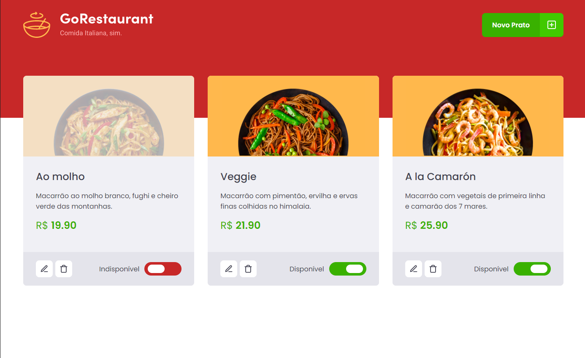
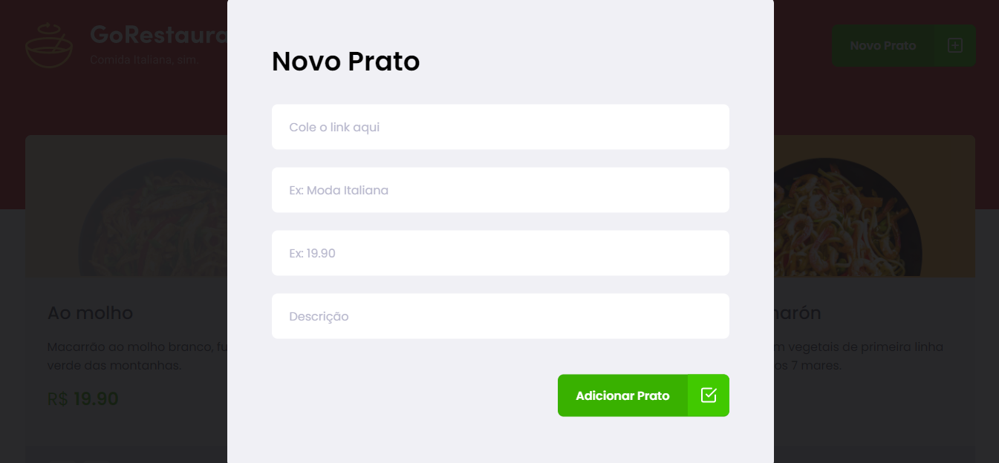

<h3 align="center">
  Desafio 10: GoRestaurant Web
</h3>

<blockquote align="center">“O tempo que leva para realizar seus sonhos vai passar de qualquer forma”!</blockquote>

<p align="center">
  <a href="https://go-restaurant-mesquini.netlify.com/" title="rocketshoes" target="_blank">
    
  </a>
</p>

## :rocket: Tela





### Utilizando uma fake API

Antes de tudo, para que você tenha os dados para exibir em tela, criamos um arquivo que você poderá utilizar como fake API para te prover esses dados.

Para isso, deixamos instalado no seu package.json uma dependência chamada `json-server`, e um arquivo chamado `server.json` que contém os dados para uma rota `/foods`. Para executar esse servidor você pode executar o seguinte comando:

```js
  yarn json-server server.json -p 3333
```

### Funcionalidades da aplicação

Agora que você já está com o template clonado e pronto para continuar, você deve verificar os arquivos da pasta `src` e completar onde não possui código, com o código para atingir os objetivos de cada rota.

- **`Listar os pratos de comida da sua API`**: Sua página `Dashboard` deve ser capaz de exibir uma listagem, com o campo `title`, `value`, e `description` e `available` de todos os pratos de comida que estão cadastrados na sua API.
- **`Adicionar novos pratos de comida a sua API`**: Em sua página Dashboard você deve abrir um modal ao clicar no botão `Novo Prato` no Header. Esse modal deve ser responsável por cadastrar uma nova `food` passando os campos `image`, `name`, `description`, `value`.

- **`Editar pratos de comida da sua API`**: Em sua página Dashboard você deve abrir um modal ao clicar no botão `Editar Prato`. Esse modal deve ser responsável por editar uma `food` passando os campos `image`, `name`, `description`, `value`.

- **`Remover pratos de comida da sua API`**: Em sua página Dashboard você deve remover um prato de comida ao clicar no botão com ícone de lixeira no componente Food.

- **`Alterar disponibilidade dos pratos de comida da sua API`**: Em sua página Dashboard você deve alterar a disponibilidade de um prato de comida ao clicar no switch que é controlado pelo valor de `available`.
